## Fullstack-Hoffyevents-react-redux

## About

 `this is  my learning based project done 90% work, I always wished I'd had a social network for event publishing to find other event publisher  to collaborate with. It's like Hoffyevent, except instead of dates it's for finding event location to city with and make tracks. View all users, view each user's profile and information,  see similar users in the sidebar. this is also can track users activity`

 

## Feature
- `Welcome landing page,`
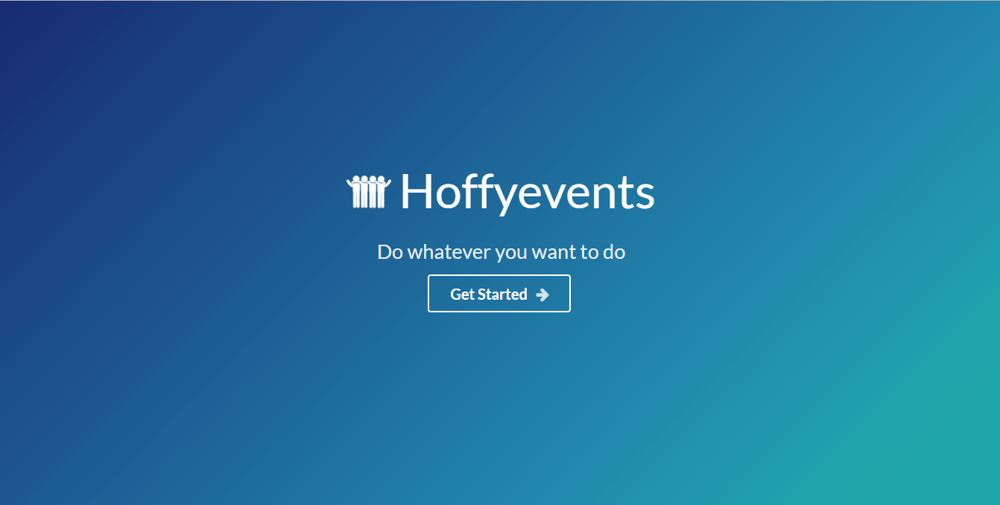

- `Show all events list in home`
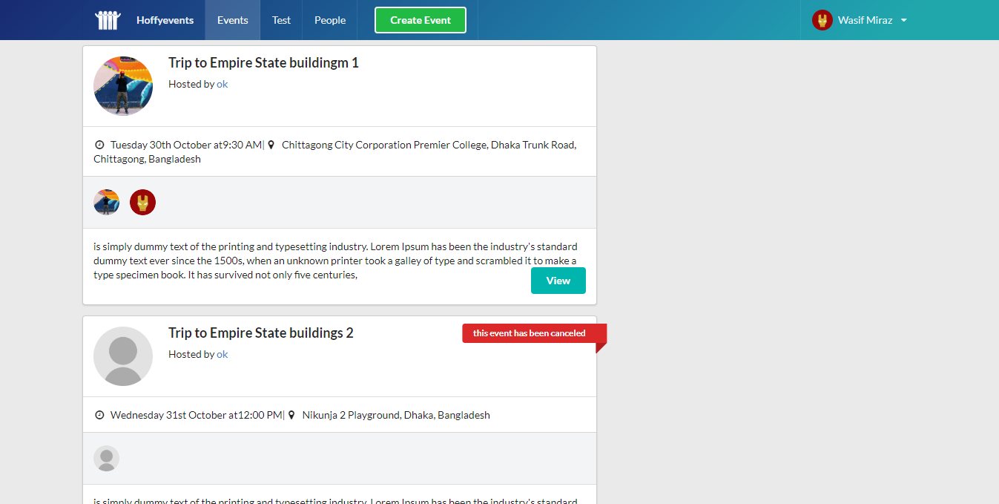

- `Uses Initial loading before eventlist showing`
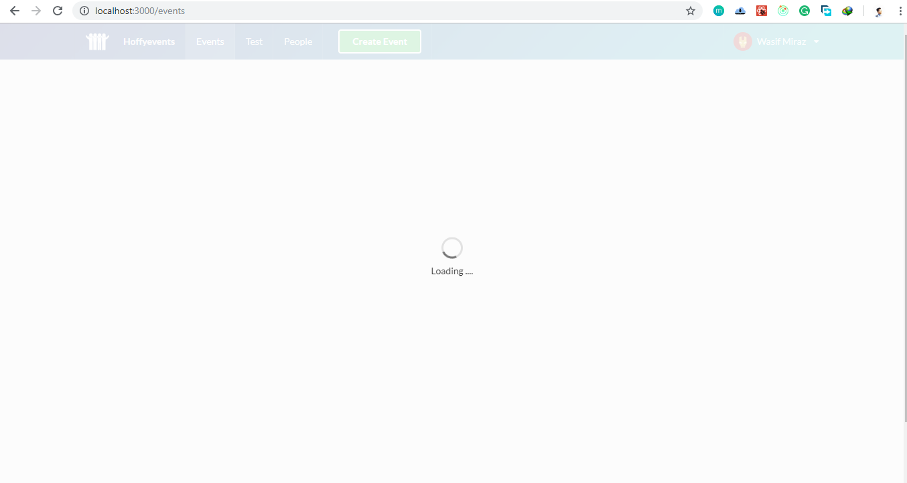

- `For login with  uses multiple Social login systems like facebook, google `
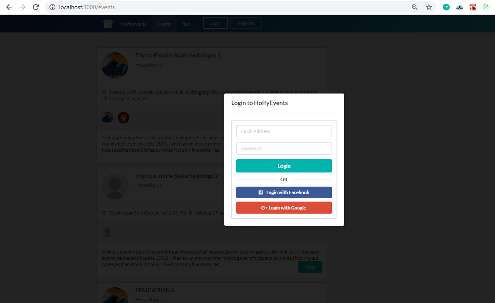

- `For signup with uses multiple Social login systems like facebook, google`
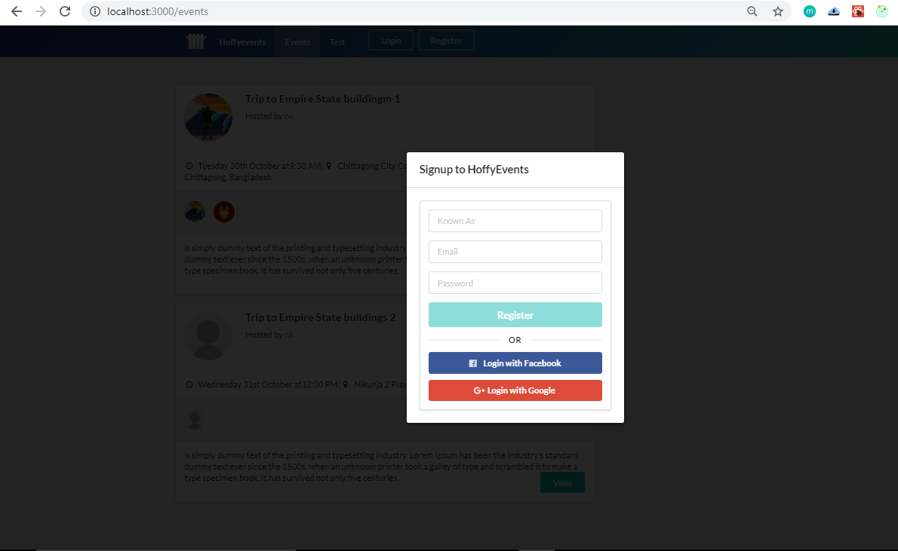

- `View event detalies`
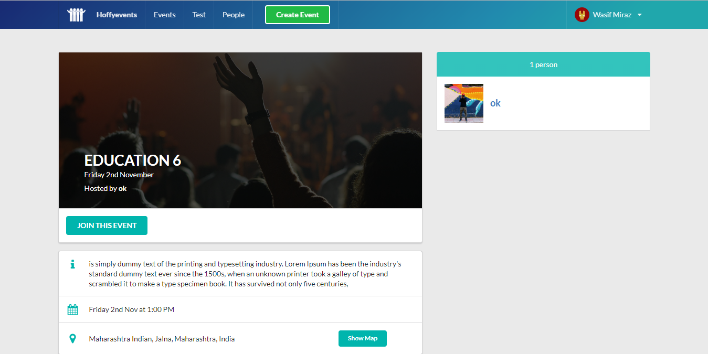
- `Track event location through react-google-map`
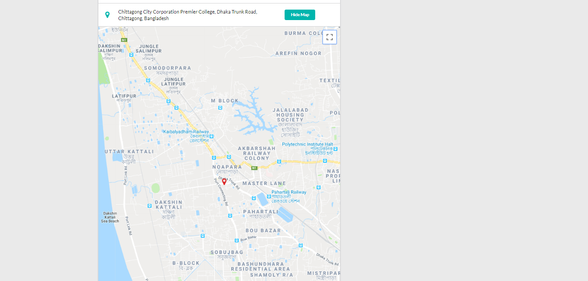

- `uses google auto completed location track in create event page`
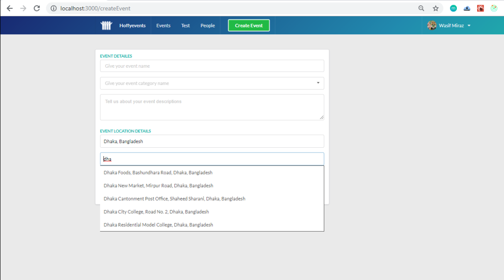

- `Cool photo uploaded with react drope zone`
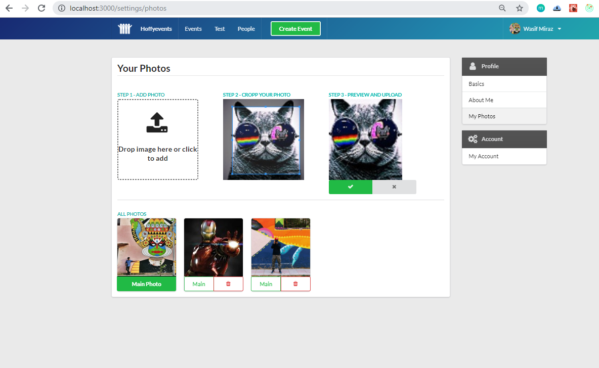

- `User profile information dashboard`
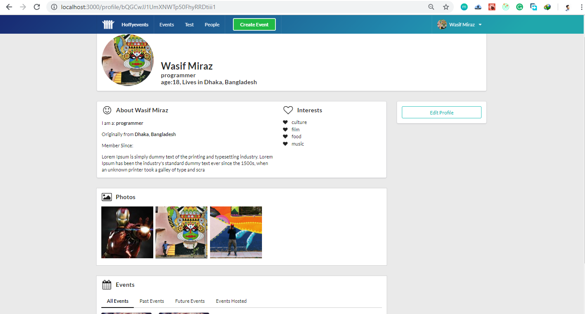

- `User about page edit`
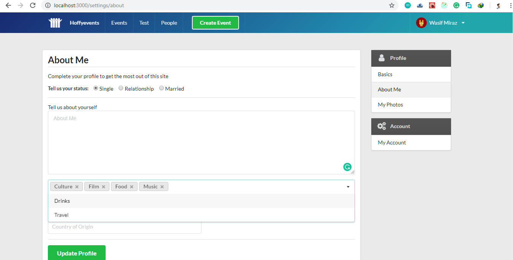

- `Used react cool infinteScroller`
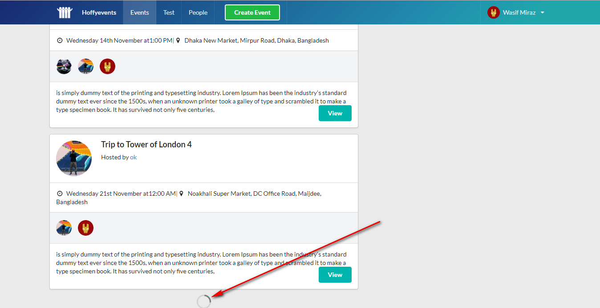

- `event detailed view for  hoster `
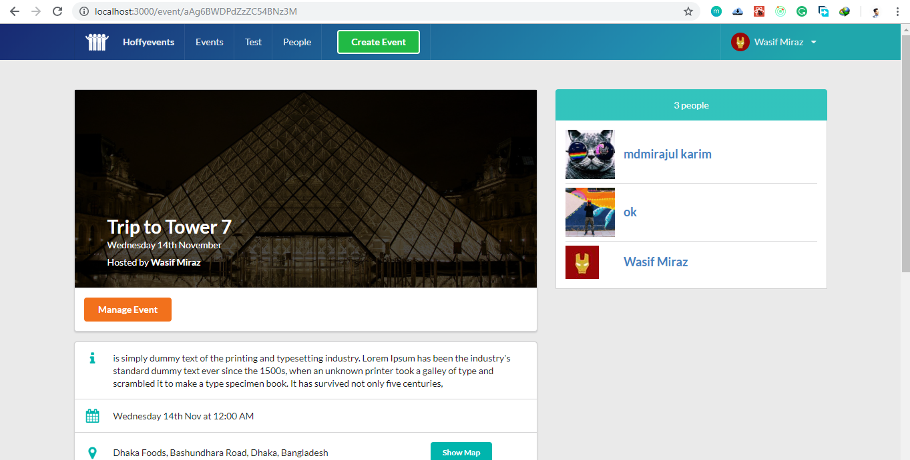

- `user can cancel or active their own events`
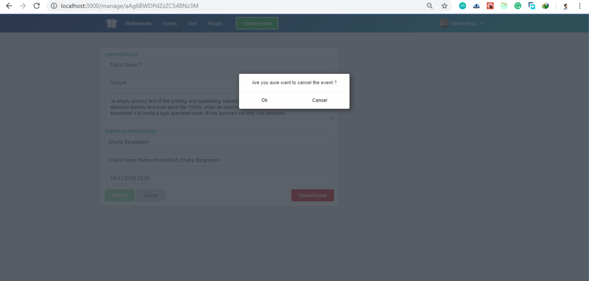

## Following technologies are used

- `React`
  - `React-router`
  - `google-map-react`
  - `react-lazyload`
  - `react-infinite-scroller`
  - `react-places-autocomplete`
  - `react-dropzone`
  - `react-loadable`
  - `react-load-script`
  - `react-places-autocomplete`
  - `react-datepicker`
  - `react-dom`
  - `react-router-dom`
  - `react-cropper`
- `Redux`
  - `react-redux`
  - `react-redux-toastr`
  - `redux-auth-wrapper`
  - `redux-form`
  - `redux-thunk`  
  - `redux-firestore`

- `Firebase`
- `Semantic-ui-react`
- `Revalidate`
- `Moment`
- `Date-fns`
- `Yarn`
  
 
     

## Supported Browsers

`By default, the generated project supports all modern browsers.`  
   

## Scripts

- `npm run clean` Deletes Build files of Server and Client
- `npm run build` Builds Server and Client
- `npm run start` Start server in production environment
- `npm run development` Start server in development environment

                                                                                                                                                                                                                                                                                                                                                                     
