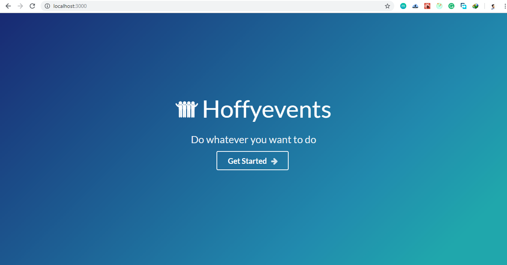

## Fullstack-Hoffyevents-react-redux

This project was bootstrapped with [Create React App](https://github.com/facebook/create-react-app).

Below you will find some information on how to perform common tasks. 
You can find the most recent version of this guide [here](https://github.com/facebook/create-react-app/blob/master/packages/react-scripts/template/README.md).

## Feature
- `Welcome landing page`

- `Show all events list in home`

- `Uses Initial loading before eventlist showing`

- `For login with  uses multiple Social login systems like facebook, google `

- `For signup with uses multiple Social login systems like facebook, google`

- `View event detalies`

- `Track event location through react-google-map `

- `uses google auto completed location track in create event page `

- `Cool photo uploaded with react drope zone `

- `User profile information dashboard`

- `User about page edit`

- `Used react cool infinteScroller`

- `event detailed view for  hoster `

- `user can cancel or active their own events `

- `event chat futurer look , but didn't work yet:/ `

## Following technologies are used

- `React`
  - `React-router`
  - `google-map-react`
  - `react-lazyload`
  - `react-infinite-scroller`
  - `react-places-autocomplete`
  - `react-dropzone`
  - `react-loadable`
  - `react-load-script`
  - `react-places-autocomplete`
  - `react-datepicker`
  - `react-dom`
  - `react-router-dom`
  - `react-cropper`
- `Redux`
  - `react-redux`
  - `react-redux-toastr`
  - `redux-auth-wrapper`
  - `redux-form`
  - `redux-thunk`  
  - `redux-firestore`

- `Firebase`
- `Semantic-ui-react`
- `Revalidate`
- `Moment`
- `Date-fns`
- `Yarn`
  
 
     

  
   

## Updating to New Releases

                                                                                                                                                                                                                                                                                                                                                                     